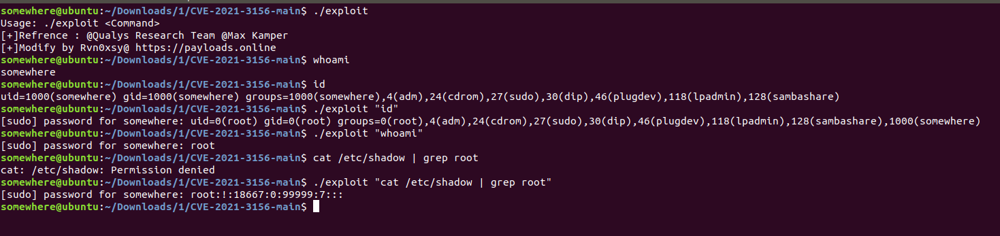

# CVE-2021-3156

> This is a warehouse modification based on [@CptGibbon](https://github.com/CptGibbon/CVE-2021-3156 ) and supports arbitrary command execution.

相关阅读：[CVE-2021-3156 - Exploit修改](https://payloads.online/archivers/2021-02-09/1)

#### Root shell PoC for CVE-2021-3156 (no bruteforce)

For educational purposes etc.

Tested on :

- @CptGibbon Ubuntu 20.04 against sudo 1.8.31
- @Rvn0xsy Ubuntu 17.10

All research credit: **Qualys Research Team**
Check out the details on their [blog](https://blog.qualys.com/vulnerabilities-research/2021/01/26/cve-2021-3156-heap-based-buffer-overflow-in-sudo-baron-samedit).

You can check your version of sudo is vulnerable with: `$ sudoedit -s Y`.
If it asks for your password it's most likely vulnerable, if it prints usage information it isn't.
You can downgrade to the vulnerable version on Ubuntu 20.04 for testing purposes with `$ sudo apt install sudo=1.8.31-1ubuntu1`

#### Usage

`$ make`

`$ ./exploit "Command"`

